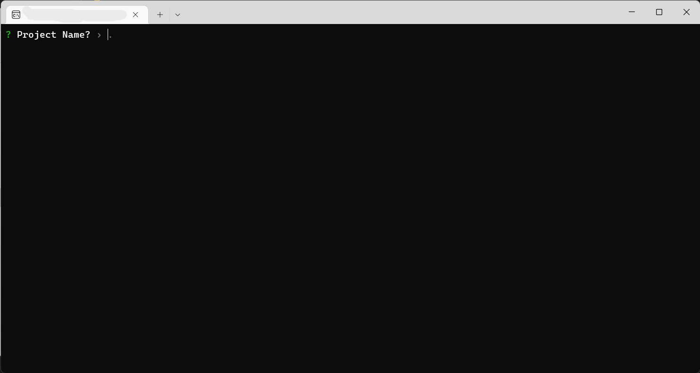
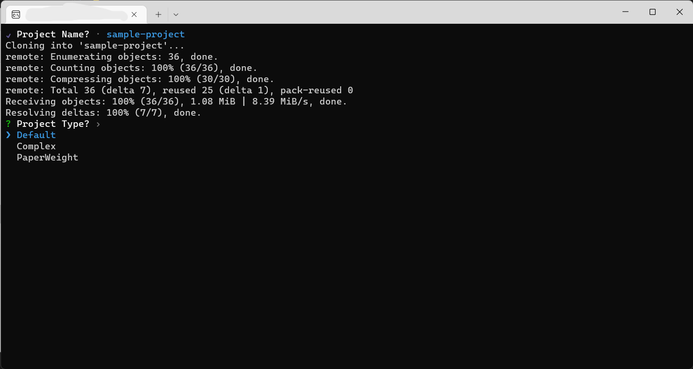
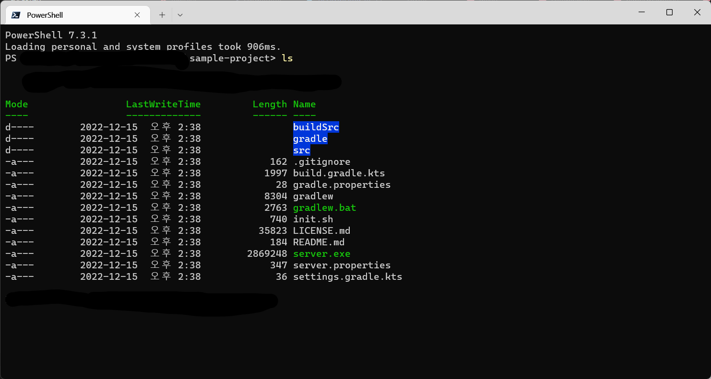

# Paper Init

A CLI wrapper for [dytroc/paper-sample](https://github.com/dytroc/paper-sample)

### 1. Download Binary from [Releases](https://github.com/dolphin2410/paper-init/releases/)

### 2. Set Project Name
This creates a new folder, or initializes in the current directory if set to '`.`' 

This process clones from [dytroc/paper-sample](https://github.com/dytroc/paper-sample)

### Set Project Type
- Default for a simple plugin
- Complex for api-impl structure
- Paperweight for interoping with minecraft code (`NMS`)

### Tada!
